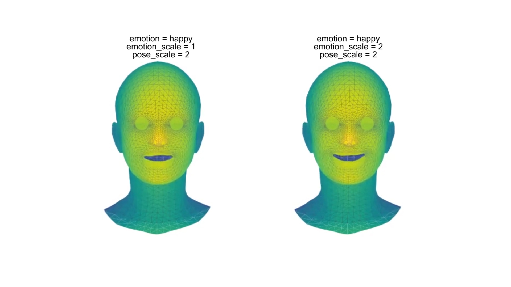

# AIM Master Class: Editable Lipsync System

This repository contains the implementation for my MSc Masterclass project at Bournemouth University, titled **"Editable Lipsync System"**.  
The project explores an AI-driven lipsync generation pipeline focusing on **direct prediction of 3D facial mesh motion** based on audio features.

---

## 🔍 Project Overview

The goal of this project is to develop a flexible lipsync system that:

- Uses pre-processed **DeepSpeech audio features** provided in the VOCA dataset (`processed_audio_deepspeech.pkl`), consistent with the original VOCA pipeline.
- Predicts **3D facial mesh sequences** corresponding to speech, with emphasis on accurate mouth motion.
- Enables **parametric control** over emotion intensity in lipsync outputs, allowing further editing of animation strength.
- Adopts a **residual learning strategy**: the model learns to predict emotional variations as offsets from a neutral lipsync baseline, enabling emotion-conditioned animation synthesis.

All model training and visualization code is implemented in a single notebook and fully executable.

---

## 📁 Repository Structure
```
.
├── LipsyncTransformer.ipynb # Main training and evaluation notebook
├── README.md # Project overview and instructions
├── emotion/ # Expression .obj templates for residual emotion computation
├── models/
│ ├── lipsync_transformer.py # Transformer-based lipsync model definition
│ ├── diffusion_ddpm.py # Optional diffusion model definition
│ ├── best_model_Trans.pth # pretrained_transformer weights 
│ └── weight/best.pth # pretrained_diffusion weights 
├── utils/
│ ├── pair_data.py # Dataset pairing logic
│ ├── sliding_window.py # Frame slicing utility
│ ├── mesh_visualizer.py # Result visualization (e.g., .obj animation)
│ └── ... # Other preprocessing/helper scripts
```

---

## 📦 Dataset

The project uses the [VOCA Training data](https://voca.is.tue.mpg.de/download.php) for 3D facial mesh sequences and audio.  
Please download the dataset from the VOCA project page and follow the directory setup as shown in the notebook. The **Jupyter notebook contains all code needed to re-run training and evaluation** if you download the dataset.

---

## 🚀 How to Run

1. **Install Python dependencies manually**  
   (e.g., PyTorch, NumPy, matplotlib, transformers, etc.)

2. **Download the VOCA dataset**, and organize it as expected by the notebook.

3. **Launch and run the notebook**, You can inspect, train, and visualize results directly within the notebook.

---

## 📌 Features

- ✅ Implements both Transformer-based and Diffusion-based (DDPM) models for predicting 3D facial mesh sequences.
- ✅ Residual-based lipsync generation with user-controllable animation intensity, adaptable to different facial templates.
- ✅ Supports user-defined emotion labels and intensity to generate adjustable lipsync animations based on residual learning.
- ✅ Visualization of predicted mouth mesh motion
- ✅ Training and testing pipeline fully contained in the Jupyter notebook.

---

## 🎥 Demo

### 🔸 Adjustable Speaking Intensity


### 🔸 Different Emotions and Intensities

| Happy       | Sad          | Angry        |
|-------------|--------------|--------------|
|  |  |  |

📺 [Click here to watch the full video demo](https://drive.google.com/file/d/1wxRKY35qL2ye3gLkV1RIwmR2qLf7dYf6/view?usp=sharing)

---

## 📚 References

- [VOCA](https://github.com/TimoBolkart/voca): Voice Operated Character Animation
- [VOCASET](https://voca.is.tue.mpg.de/download.php): 3D face animation dataset used for training
- [FaceFormer: Speech-Driven 3D Facial Animation](https://github.com/EvelynFan/FaceFormer)
- [MeshTalk](https://github.com/facebookresearch/meshtalk): Mesh-based speech-driven facial animation

## 👤 Author

Du Siyao (SiaDu)
MSc Artificial Intelligence for Media
Bournemouth University
Contact: s5722875@bournemouth.ac.uk


